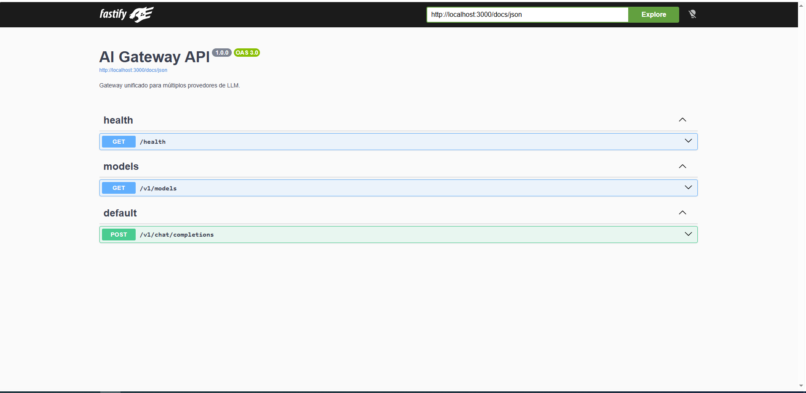
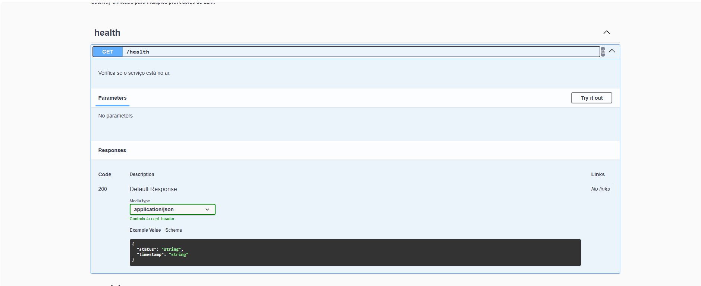

# 🧠 Axon — AI Agent Runtime with Cognitive Cells

[](https://github.com/isaias4321/axon/actions/workflows/ci.yml)
[](https://nodejs.org/)
[](https://www.typescriptlang.org/)
[](https://fastify.dev/)
[](#-running-the-tests)
[](./LICENSE)

*[Versão em português](README.pt-BR.md)*

This project started as a **unified gateway for multiple LLM providers**
(OpenAI, Anthropic, Google Gemini and Groq) and evolved into an
**AI Agent Runtime**: a system that analyzes a task written in natural
language, decides on its own the best execution strategy (direct answer,
multi-agent orchestration, or an autonomous loop), routes to the most
suitable model, executes with real tools (grep, filesystem, shell, HTTP),
validates its own output, learns from the feedback of past runs, and —
when the intent is recognizable — delegates to specialized cognitive cells
(debugging, planning, code review, failure recovery).

> This isn't a chat wrapper. It's the engineering layer — routing,
> resilience, memory, evaluation, autonomy — that separates "calling an
> LLM API" from operating an AI agent in production.

## 🖼️ Demo

The chat interface, running locally:

<!-- TODO: add a real screenshot of the UI at docs/chat-ui.png before
     publishing (run `npm run dev`, open http://localhost:3000, take the
     screenshot) and replace the line below with:
     
-->

Browsing the interactive documentation (Swagger UI):

<video src="docs/demo.mp4" controls width="700">
  Your browser doesn't support embedded video — see the file at
  <a href="docs/demo.mp4">docs/demo.mp4</a>.
</video>



Running inside Docker itself (`docker compose up --build`), with the
`HEALTHCHECK` hitting `/health` automatically every 30s:

<video src="docs/docker-demo.mp4" controls width="700">
  Your browser doesn't support embedded video — see the file at
  <a href="docs/docker-demo.mp4">docs/docker-demo.mp4</a>.
</video>



## 🧠 The agent's architecture, as a table

| Phase | What it does | Where it lives |
|---|---|---|
| **F1 — Analysis & Decision** | Classifies the task (category, required capabilities, complexity) and decides the execution strategy (`single_agent` / `multi_agent` / `autonomous`) | `src/adaptive/taskAnalyzer.ts`, `decision.ts` |
| **F2 — Scoring & Model Router** | Ranks the available models for the task and picks the best one, with an adaptive strategy | `src/adaptive/scoring.ts`, `modelRouter.ts`, `strategyEngine.ts` |
| **F3 — Cost & Tokens** | Estimates tokens and cost *before* executing, and measures real cost afterward | `src/adaptive/tokenEstimator.ts`, `costEstimator.ts` |
| **F4 — Agent Runtime** | Executes the task end to end and keeps short-term memory per session | `src/adaptive/runtime.ts` |
| **F5 — Multi-agent orchestrator** | For complex tasks: an Analysis → Planning → Code → Validation pipeline, with accumulated context and fail-open per step | `src/adaptive/orchestrator.ts` |
| **F6 — Autonomous loop** | Plans, executes, validates and iterates on its own, with an iteration budget, stagnation ("no-progress") detection, and real tools | `src/adaptive/autonomous.ts`, `planner.ts`, `validator.ts`, `budget.ts`, `progressTracker.ts` |
| **F7 — Self-evolution** | Persists skills, strategy scores and reflections to SQLite; future decisions use that history (a real feedback loop, not just in-memory) | `src/evolution/` |
| **F8 — Tools & Observability** | Real tools (grep/filesystem/shell/HTTP) so the agent can actually act, plus observability routes over what it has learned | `src/adaptive/tools/`, `src/routes/observability.ts` |
| **F9 — Cognitive Cells** | A layer of specialized cells (debug, planning, research, validation, recovery, code review, config) with deterministic routing, inter-cell delegation, and shared memory | `src/cognitive/` |

Each phase has its own test suite (see [🧪 Running the
tests](#-running-the-tests)) and the integrations between phases are
covered by dedicated cross-phase tests — F1 feeds F2/F5/F6/F9, F7
influences F2's model ranking, F6 can consult F9's `RecoveryCell` when it
detects stagnation, and so on.

## ⚙️ The gateway underneath the agent

The system's foundation is still a solid LLM gateway — it's what gives
every phase above a resilient execution layer:

| Common problem when integrating multiple AIs directly into your code | How the gateway solves it |
|---|---|
| Each provider has a different request/response format | One interface: `{ provider, model, messages }` for any of them |
| A provider's rate limit gets hit without warning | Its own rate limiting (token bucket) per client key |
| Transient errors (429, 5xx) crash the application | Automatic retry with exponential backoff + jitter |
| Repeated questions cost money again | TTL cache (in-memory, or distributed via Redis) |
| A single LLM call hangs the request indefinitely | Real timeout via `AbortController`, propagated from the route down to the provider's `fetch` — not just "stop waiting", it actually cancels |
| Switching providers means rewriting the whole integration | Interchangeable adapters behind the same interface (`ProviderAdapter`) |

## 🧱 Stack

| Layer | Technology |
|---|---|
| Runtime | Node.js 22 |
| Language | TypeScript 6 (strict mode, `noUncheckedIndexedAccess`, `noEmitOnError`) |
| HTTP framework | Fastify 5 |
| Validation | Zod 4 |
| Persistence | SQLite (native, `node:sqlite`) for evolution memory; optional Redis 7 for distributed cache/rate limiting |
| Logging | Pino (structured JSON logs, no `console.*` in production code) |
| Tests | Vitest 4 — **544 tests** |
| Lint | ESLint 10 + typescript-eslint (flat config) |
| API docs | Swagger/OpenAPI (`@fastify/swagger`) at `/docs` |

## 📡 Endpoints

| Route | What it does |
|---|---|
| `GET /health` | Public health check |
| `GET /v1/models` | Lists available models per configured provider |
| `POST /v1/chat/completions` | Direct chat with one provider (unified format), with cache, rate limit, retry and streaming (SSE) |
| `POST /v1/decide` | F1+F2: analyzes a task and returns the recommended strategy and model, without executing |
| `POST /v1/run` | F1→F9: analyzes, decides and **executes** the task — `single_agent`, `multi_agent` or `autonomous`; accepts `useCognitive: true` to try the Cognitive Router before the default executor |
| `POST /v1/cognitive` | Routes a task directly through the Cognitive Cells (F9), bypassing the agent |
| `GET /v1/cognitive/health` | Health check for the Cognitive Cells |
| `GET /v1/observability/{episodes,skills,reflections,strategy-scores,curiosity,goals,metabolism,summary}/:sessionId` | F8: exposes what the agent has learned/persisted in a session (data that was previously write-only in SQLite) |
| `GET /` | Web chat interface for talking to the agent (static files via `@fastify/static`) |

Every route under `/v1/*` requires the `x-api-key` header. `/health`,
`/docs` and the web interface at `/` are public.

## 📁 Structure

```
src/
├── config.ts, app.ts, server.ts     # bootstrap: env (Zod), Fastify, entrypoint
├── schemas/chat.ts                  # request/response contracts (Zod)
├── providers/                       # OpenAI/Anthropic/Gemini/Groq adapters
│   └── openAiCompatible.ts          # shared factory (3 of the 4 providers)
├── lib/
│   ├── cache.ts, redisCache.ts      # CacheStore: memory or Redis, same interface
│   ├── rateLimiter.ts, redisRateLimiter.ts
│   ├── retry.ts                     # exponential backoff + jitter
│   ├── logger.ts                    # pino (createLogger + getDefaultLogger)
│   └── db/                          # SQLite: episodes, skills, reflections,
│                                     #   strategy_scores, curiosity_signals, goals, metabolism
├── adaptive/                        # F1–F6, F8
│   ├── taskAnalyzer.ts, decision.ts         # F1
│   ├── scoring.ts, modelRouter.ts, strategyEngine.ts  # F2
│   ├── tokenEstimator.ts, costEstimator.ts  # F3
│   ├── runtime.ts                           # F4 — executeTask()
│   ├── orchestrator.ts                      # F5 — multi-agent pipeline
│   ├── autonomous.ts, planner.ts,           # F6 — autonomous loop
│   │   validator.ts, budget.ts, progressTracker.ts
│   └── tools/registry.ts                    # F8 — real grep/filesystem/shell/HTTP
├── evolution/                       # F7 — skills, strategy, curiosity, goals,
│                                     #   metabolism, reflection (self-evolution)
├── cognitive/                       # F9
│   ├── router.ts                    # CognitiveRouter — deterministic classification
│   ├── supervisor.ts                # CellSupervisor — delegation, cycle, budget, timeout
│   ├── context.ts                   # shared memory/context between cells
│   ├── memory.ts                    # CognitiveMemory (filesystem + opt-in SQLite)
│   └── cells/                       # debug, planning, research, validation,
│                                     #   recovery, code-review, config
└── routes/
    ├── health.ts, models.ts, chat.ts
    ├── decide.ts, run.ts            # F1–F9 over HTTP
    ├── observability.ts             # F8
    └── cognitive.ts                 # F9

public/  # web chat interface (plain HTML/CSS/JS, no build step)
test/    # 544 tests — per-module unit tests + per-phase integration + cross-phase E2E
```

## 🚀 Running locally

```bash
git clone https://github.com/isaias4321/axon.git
cd axon
npm install
cp .env.example .env   # fill in at least one key: OPENAI_API_KEY, ANTHROPIC_API_KEY, GEMINI_API_KEY or GROQ_API_KEY
npm run dev
```

Open the interactive docs at **<http://localhost:3000/docs>**.

## 💬 Web chat interface

Opening **<http://localhost:3000/>** in your browser gives you a full chat
interface for talking to the agent — not just a static demo, a real
front-end (plain HTML/CSS/JS, no build step) served by the API itself via
`@fastify/static`.

- **Three execution modes**, chosen per conversation:
  - **Automatic** — calls `POST /v1/run`; the agent (F1→F6) decides on its
    own between a direct answer, multi-agent orchestration, or an
    autonomous loop.
  - **Cognitive** — calls `POST /v1/run` with `useCognitive: true`,
    forcing the `CognitiveRouter` (F9) to classify the intent and dispatch
    to the Cognitive Cells.
  - **Direct** — calls `POST /v1/chat/completions` against a specific
    provider/model (the list is loaded from `GET /v1/models`), bypassing
    the agent.
- **Real-time progress** (Automatic/Cognitive modes): the UI opens
  `/v1/run` in streaming mode (`stream: true`, Server-Sent Events) and
  shows each real phase as it happens — "analyzing the task", "iteration
  2/5: executing step X", "validating", etc. — instead of a generic
  "loading" spinner. It isn't simulated: these are the same events the
  runtime (F4/F6/F5) emits internally, the same text that shows up in the
  server logs.
- **A real trace under every response**: instead of only showing text,
  the UI surfaces what the API actually returned — the chosen strategy,
  the provider/model used, estimated cost, duration, autonomous-loop
  iterations (if any), or the chain of Cognitive Cells that were invoked.
  That's the real difference between "calling an LLM" and "operating an
  agent" — the interface makes the decision visible instead of hiding it
  behind a generic chat.
- **Persistent session**: a `sessionId` is generated and reused across
  messages (short-term memory — F4); "new" in the sidebar starts a blank
  session.
- **Persistent session memory + artifacts**: every message is saved to
  SQLite (`messages`), not just RAM — it survives a container restart. Every
  uploaded file, extracted folder, or generated project/zip becomes a
  tracked **artifact** per session (`artifacts` + `session_context`), with a
  deterministic notion of "current artifact"/"current project" — resolved
  from the database, never guessed by the LLM. That's what lets you ask
  "can you improve the current project?" or "how do I run this?" after
  uploading/generating a zip, without repeating the filename. See
  `src/adaptive/artifacts.ts`.
- **File attachments and deliveries**: the **+** button (or drag and drop)
  uploads files (`.zip`, `.rar`, PDFs, images...) to the workspace, and the
  agent can **read the contents** of real `.zip` and `.rar` files (the
  latter via `unrar-free`, installed in the Docker image). Asking it to
  **build a project** ("make a project and send it to me as a zip")
  generates every file in a single structured LLM call (`ProjectTool` +
  `projectScaffold.ts`), zips it preserving the folder structure, and the
  file path shows up in the reply as a **download button**. The agent
  tells a *question* from an *order*: "can you create a zip?" gets a text
  answer; "make a project and send it as a zip" gets executed. Known
  limit: **creating** `.rar` is not possible (there is no free encoder) —
  the agent explains that and delivers a `.zip` instead.
- The key (`x-api-key`) lives only in your browser's `localStorage` and is
  sent straight from the client to the API — this front-end has no
  backend of its own, so there's nowhere for the key to "pass through"
  besides your own browser.

By default the UI assumes the API is on the same origin; in **Settings**
(gear icon) you can point it at a different URL, useful if you serve the
front-end separately from the API in production.

## 📡 Example usage (raw API)

If you'd rather integrate directly, without the web interface:

**Direct chat** (no agent — just the gateway):

```bash
curl -X POST http://localhost:3000/v1/chat/completions \
  -H "Content-Type: application/json" \
  -H "x-api-key: dev-key" \
  -d '{
    "provider": "openai",
    "model": "gpt-4o-mini",
    "messages": [{ "role": "user", "content": "Explain what RAG is in one sentence." }]
  }'
```

**Let the agent decide and execute** (F1→F9):

```bash
curl -X POST http://localhost:3000/v1/run \
  -H "Content-Type: application/json" \
  -H "x-api-key: dev-key" \
  -d '{
    "task": "Investigate why /v1/chat/completions is returning 429 and propose a fix",
    "useCognitive": true
  }'
```

With `useCognitive: true`, the `CognitiveRouter` classifies the intent
(here, "debug") and dispatches to the `DebugCell`, which may delegate to
the `ResearchCell` (real evidence via `grep`) before responding — if the
router doesn't recognize the intent, the flow automatically falls back to
the default executor (fail-open, the request never breaks).

**Just decide, without executing:**

```bash
curl -X POST http://localhost:3000/v1/decide \
  -H "Content-Type: application/json" \
  -H "x-api-key: dev-key" \
  -d '{ "task": "Refactor the auth module to use JWT" }'
```

**Streaming** (Server-Sent Events): add `"stream": true` to the body of
`/v1/chat/completions` and consume the response as incremental text.

## 🧪 Running the tests

```bash
npm test          # runs the suite once — 544 tests
npm run typecheck # type-checks without emitting a build
npm run lint       # checks code quality/style
```

The suite has three parts:

- **329 deterministic/offline tests** — covering F1 through F9 (task
  analysis, scoring, cost estimation, agent runtime, orchestration,
  autonomous loop, SQLite-backed self-evolution, tools, Cognitive Cells,
  and cross-phase integrations), all with mocked LLM providers. They make
  no real network calls and don't depend on external infrastructure.
- **12 tests against a real Redis** (`test/redisCache.test.ts`,
  `test/redisRateLimiter.test.ts`), including a concurrency test that
  fires 20 simultaneous requests against the same rate-limit bucket and
  confirms the Lua script is atomic. Spin up a local Redis before running
  `npm test` (`docker run -p 6379:6379 redis:7-alpine`) or point at
  another address via `REDIS_URL`. Without Redis available, only those 12
  fail — the rest of the suite runs normally. In CI, a Redis service
  container is spun up automatically.
- **1 optional E2E test against a real Gemini** (`test/real-feedback-loop.e2e.test.ts`),
  which makes real HTTP calls to prove that the feedback loop (F7)
  persists and influences future decisions across two real runs —
  automatically skips (`skipIf`) when `GEMINI_API_KEY` isn't set, instead
  of failing. Doesn't run in CI, since it needs an API key and network
  access.

## 🐳 Running with Docker

**With Docker Compose (recommended — brings up the API + Redis with one command):**

```bash
cp .env.example .env   # fill in your keys before starting
docker compose up --build
```

**With plain Docker, no compose** (without Redis configured, the gateway
uses in-memory cache and rate limiting — and falls back to memory
automatically even with `REDIS_URL` set, if Redis is unreachable at boot):

```bash
docker build -t axon-runtime .
docker run -p 3000:3000 --env-file .env axon-runtime
```

## ☁️ Deploy (Render — free tier)

1. Create a new **Web Service** pointing at this repository
2. **Environment**: Docker (Render auto-detects the `Dockerfile`)
3. In **Environment Variables**, add the keys from `.env.example`
   (at least `GATEWAY_API_KEYS` and one real provider key)
4. **Health Check Path**: `/health`
5. Deploy — the public URL already serves Swagger at `/docs`

> 💡 Render's free tier sleeps after 15 min of no traffic — fine for a
> portfolio demo, not for real production use.

## 🧠 Design decisions

- **The API key never passes through an intermediate backend.** The web
  interface is just static HTML/CSS/JS; it calls `/v1/*` directly from
  the user's browser, with the key they configured themselves (stored in
  `localStorage`, never sent to anything besides the API itself). That's
  why auth was scoped to `/v1/*` — it used to cover everything except
  `/health`/`/docs`, which would have blocked the UI's static assets from
  loading at all.
- **Fail-open across the whole agent layer.** If the `CognitiveRouter`
  doesn't recognize the intent, if a cell fails, or if Redis is
  configured but unreachable, the system never returns an error because
  of it — it falls back to the next default behavior (shallow executor,
  on-disk memory, in-memory cache). This is explicitly tested, not just
  documented.
- **Timeout with real cancellation, not just "stop waiting".** `/v1/run`
  creates an `AbortController` per request; when the configured limit hits
  (`RUN_TIMEOUT_MS`, 10 minutes by default), the signal propagates down to the autonomous loop (checked every
  iteration) and to each provider's `fetch` via `AbortSignal.any()` — the
  background execution is genuinely interrupted, it doesn't keep burning
  LLM tokens after the HTTP response has already been sent.
- **One shared factory for the OpenAI-format-compatible providers.**
  OpenAI, Gemini and Groq all expose chat completions in the same shape;
  the three adapters are thin wrappers around a single factory
  (`openAiCompatible.ts`). Anthropic has its own adapter, for a genuinely
  different format.
- **Distributed cache and rate limiting are opt-in via config**, with an
  automatic fallback to memory if Redis is configured but doesn't respond
  at boot — the project never goes down because of an optional
  dependency.
- **Automatic fallback across providers on transient errors, everywhere an
  LLM call actually happens.** If the chosen model/provider returns a
  recoverable error (503/UNAVAILABLE, 502/BAD_GATEWAY, 429/RATE_LIMIT,
  404/model_not_found), the runtime automatically tries the next candidate
  from the ranking (`decision.rankedCandidates`) before giving up — instead
  of failing the whole task because one specific provider is temporarily
  down. Configuration errors (401, 400) don't trigger fallback — only
  genuine provider-side unavailability does. The logic lives in a single
  module (`src/adaptive/providerFallback.ts`) reused across the 4 places
  where an LLM call actually happens: direct execution, and the 3 pieces
  of the autonomous loop (planner, executor, validator/critic) — keeping
  it centralized avoids what already happened once here: fixing fallback
  in one place and forgetting the other three, leaving the mode most used
  for complex tasks (the autonomous loop) with no protection at all.
- **The distributed rate limiter uses a Lua script, not a separate
  GET+SET**, so the token-bucket calculation is atomic in Redis —
  verified by a test that fires 20 concurrent requests against a bucket
  with capacity 5 and confirms exactly 5 get through.
- **The `CognitiveRouter`'s classification is deterministic**, with no
  external LLM and no network dependency — routing to the Cognitive Cells
  works fully offline and is covered by tests that do no I/O.
- **Self-evolution is persisted, not just kept in process memory.** F7
  writes skills, strategy scores and reflections to SQLite; a second run,
  in a fresh process, loads that history and it changes F2's model
  ranking — tested with two real sequential runs, not just simulated
  within a single test.

## ⚠️ Known limitations

No system is perfect, and one of this project's goals is to be upfront
about where it can still improve:

- **`PlanningCell` generates plans by category, not fully guided by
  evidence.** The action plan is picked from a template based on the
  task's category (`feature`/`refactor`/`debug`/`architecture`/`general`);
  the diagnosis received from other cells shows up in the success
  criteria, but doesn't yet change the plan's actual steps (priority,
  effort, number of steps). It works well as a deterministic, predictable
  structure; it isn't yet a planner that adapts to the content of the
  evidence.
- **`ShellTool` uses a denylist, not an allowlist.** Known-dangerous
  patterns like `rm -rf` and `sudo` are blocked, but any command outside
  that list is allowed. Fine for local/supervised dev use; for exposing
  an agent to untrusted input in production, an explicit allowlist would
  be safer.
- **The model catalog (`src/adaptive/modelCatalog.ts`) is a static list** —
  providers deprecate models over time (e.g., Groq retired
  `llama-3.1-8b-instant` and `llama-3.3-70b-versatile` in August 2026), and
  a deprecated model in the catalog returns 404 until someone updates the
  list by hand. The runtime already tries the next ranked candidate
  automatically when this happens (see "Automatic fallback" above), so the
  symptom becomes "always picks the more expensive model" rather than an
  error — but it's worth checking `GET /v1/models` periodically against
  the provider's own models page.
- **No metrics/tracing observability** (Prometheus, OpenTelemetry) — right
  now visibility comes from structured logs (pino) and the
  `/v1/observability/*` routes.
- **No live public deployment** — the `Dockerfile` and deployment steps
  are ready, but the demo runs locally/via Docker.

## 🗺️ Possible next steps

- [ ] Have `PlanningCell` use the complexity/implications analysis to
      change the plan's steps, not just the success-criteria text
- [ ] Migrate `ShellTool` from a denylist to a configurable allowlist
- [ ] A `/metrics` endpoint in Prometheus format
- [ ] Circuit breaker for unstable providers (an extension of the existing retry)
- [ ] Local models via Ollama
- [ ] Automatic routing based on observed cost/latency, not just estimates

## ⚠️ A note on versions

This project uses TypeScript 6.0.3 instead of TypeScript 7 (the Go-based
rewrite of the compiler): at the time this was built, `typescript-eslint`
didn't officially support TS 7 yet. I preferred a project with fully
working lint, typecheck and CI over chasing the newest version for its
own sake.

## 📄 License

MIT
